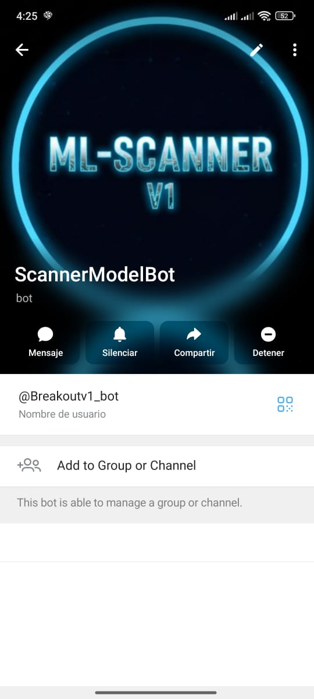
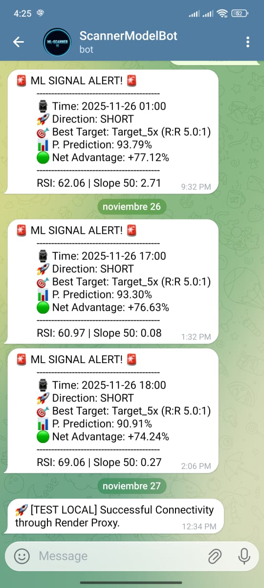

#  🤖 ML-Scanner V1: Algorithmic Trading Alert System
This project implements an automated **Machine Learning (ML)** system designed to **scan cryptocurrency markets** 24 hours a day and issue **alerts** in real time directly to **Telegram**.


---

## ✨ Key Features

* **Machine Learning Analysis:** Uses a trained ML model to predict a potential market entry. Only signals with a high degree of certainty trigger an alert.
* **Distributed Architecture (Proxy Pattern):** Employs a **Proxy Pattern** by decoupling services in **Hugging Face Spaces** and **Render.** This is key to overcoming network constraints in cloud environments, ensuring secure and reliable delivery of alerts to the Telegram API.
* **24/7 Asynchronous Scanning:** The scanning logic is executed periodically by a **scheduler** that operates in a constant background thread within the main application.
* **On-Demand Triggering:** Provision of a specific endpoint (`/run_scanner`) to **force** an immediate market scan, without waiting for the scheduler's scheduled cycle.

---

## 🌐 Deployment and Public Endpoints

The system is operational and distributed across **two cloud environments** to ensure full functionality:

| Service | Platform | Main URL | Purpose |
| :--- | :--- | :--- | :--- |
| **Scanner & ML Logic** | Hugging Face Spaces | `https://ivang-prog-ml-scannerv1.hf.space/docs` | It contains the **ML model** and the **scheduler** logic. |
| **Telegram Proxy** | Render | `https://model-breakup1-1.onrender.com/docs` | **Securely forward** Scanner alert requests to the Telegram API. |

---

## 💻 Local Installation and Execution (Developer Mode)

The project is fully **Dockerized** to ensure reproducibility in any environment.

### 1. Prerequisites

* **Docker** and **Docker Compose** must be installed on your system.
* A `.env` configuration file in the root of the project with the authentication variables for Telegram (see section 2).

### 2. Environment Variable Configuration

Create the `.env` file to include your Telegram bot credentials:

```dotenv
TELEGRAM_BOT_TOKEN="..." # Your bot token
TELEGRAM_CHAT_ID="..."   # ID of the chat or channel where alerts will be sent

```

### 3. Service Execution (Docker Compose)
To run the Scanner service on your machine for local testing:
```docker compose up --build -d scanner
```

**Note:** For local integration testing against the deployed Render Proxy, you only need to run the scanner service locally, as the proxy must be running on Render. If you want to run both services locally (Scanner and Proxy), you will need an extended docker-compose configuration as in the project file.

### 4. Local Access and Debugging
You can access the interactive documentation (Swagger UI) for the local Scanner and run tests:

``http://localhost:7860/docs
``
Use the /run_scanner endpoint to force an immediate market scan.

---
## ☁️ Manual Testing in the Cloud (Deployed Mode)
This section is designed for the project owner or collaborators who have access to the Telegram channel, allowing verification of the model logic and connectivity of the deployed system.

###1. Accessing Swagger

Navigate to the documentation URL for your Hugging Face Space:

``https://ivang-prog-ml-scannerv1.hf.space/docs
``

### Bot Image message


